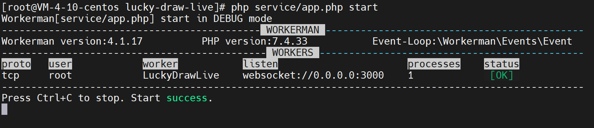
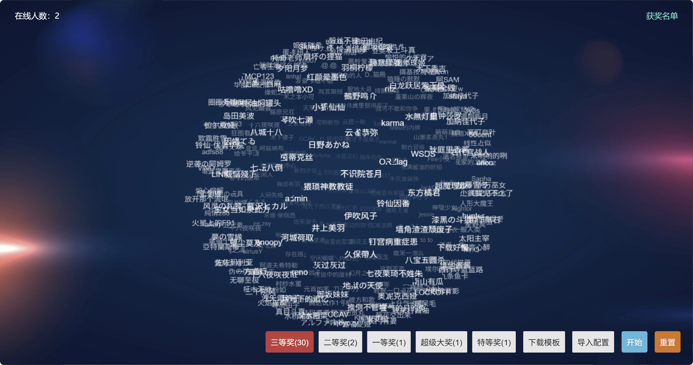

# 幸运抽奖直播

## 实现原理

通过 websocket 服务，将主控端的操作同步到被控端，实现类似直播效果。

## 启动

服务端 service 目录。

- 默认监听 3000 端口
- 服务端仅做消息转发，不处理业务逻辑

```bash
cd service
# 安装依赖
composer install
# 启动 websocket 服务
php app.php start -d
```



客户端 client 目录。

- 默认连接本地 3000 端口（可在 `client/js/server.js` 文件中修改）

- 参加者名单和奖项通过 `config.xlsx` 模板文件导入（注意：sheet 表的第一行不能删除）

- 主控 master 页面（仅能开一个）



- 被控 slave 页面（可开多个）


- 中奖名单


## 纯本地模式

默认是同步推送模式。

- 若要启用纯本地模式，只需修改 `client/js/server.js` 文件中的 `enabled` 配置为 `false`

- 纯本地模式不需要启动服务端 service，同时，被控端 slave 也无法实现同步

## 抽奖流程

1. 导入配置文件
2. 选择当次要抽奖的奖项
3. 点击『开始』按钮，进入抽奖状态
4. 点击『停！』按钮，生成抽奖结果
5. 点击任意奖项按钮，可以回到闲置状态，已中奖的用户标记为黄色，不会二次命中

PS：滚动鼠标滚轮，可以放大或缩小球体

## 主控端身份认证

以 Nginx 配置为例：

- 安装 htpasswd 工具

```
 yum install -y httpd-tools
 # apt-get install apache2-utils
```

- 创建密码文件（`-c` 参数表示创建一个新的文件。如果之后要添加更多用户，记得去掉 `-c` 参数以免覆盖现有的文件）

```bash
 
 htpasswd -c /www/server/nginx/conf/htpasswd/lucky-draw-live master
```

- 修改 Nginx 配置文件

```nginx
server {
    # ... 其他配置项 ...

    location = /master.html {
        auth_basic "请输入管理员密码";
        auth_basic_user_file /www/server/nginx/conf/htpasswd/lucky-draw-live;
    }

    # ... 其他配置项 ...
}
```

- 测试配置并重启 Nginx

```bash
nginx -t
nginx -s reload
```

